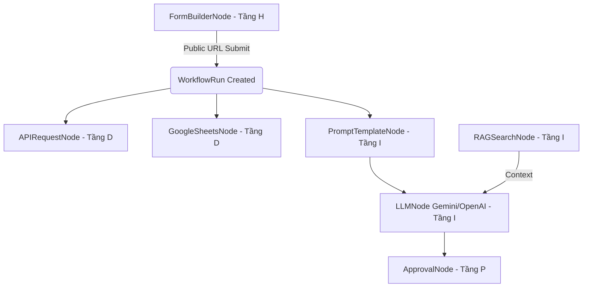

# DX-OS HPDI Complete Workflow Nodes Design Specification

- **Date**: 2026-07-20
- **Scope**: Tầng H, P, D, I (Human, Process, Data, Intelligence) Nodes
- **Target Projects**: init-django-project-main (Backend: Django REST Framework, Frontend: React Flow SPA)

---

## 1. Overview & HPDI Architecture

To fulfill the VFOSSA OLP-35 requirements, the workflow engine must support the full evolutionary spectrum of digital operations (HPDI). We are implementing the remaining advanced workflow nodes:



---

## 2. Tầng H: Human Interaction (Form Builder)

### Dynamic Form Builder Node (`FormBuilderNode`)
- **Config Schema (JSON)**:
  ```json
  {
    "fields": [
      { "name": "employee_name", "type": "text", "label": "Họ và tên" },
      { "name": "amount", "type": "number", "label": "Số tiền đề xuất" },
      { "name": "reason", "type": "textarea", "label": "Lý do chi" }
    ]
  }
  ```
- **Backend Endpoints**:
  1. `GET /api/v1/workflows/<uuid>/form/` (Public - Unauthenticated)
     - Returns the form fields definition to render dynamically.
  2. `POST /api/v1/workflows/<uuid>/submit-form/` (Public - Unauthenticated)
     - Receives form data payload.
     - Creates a new `WorkflowRun` database entry.
     - Saves payload directly under `state_data` using the form node ID.
     - Sets status to `running`, starts Celery background task `run_workflow_task`.
- **Frontend Public Page**:
  - Route: `/public/form/:workflowId` (Public route bypassing login guards).
  - Dynamically builds forms using custom styles ( Outfit font, rounded cards, input fields).
  - Calls `submit-form/` on submission and shows success status.

---

## 3. Tầng D: Data Integration (HTTP API & Google Sheets)

### HTTP Client Node (`APIRequestNode`)
- **Parameters**:
  - `url`: API endpoint string (supports `{variable}` interpolation).
  - `method`: GET, POST, PUT, DELETE.
  - `headers`: JSON key-value dictionary.
  - `body`: Raw body string (JSON or Form variables) with variables interpolation.
- **Execution Logic**:
  - Uses `requests` module.
  - Resolves variables (e.g. `{form_1.amount}`) from the execution's `state_data`.
  - Saves Response: `{"status_code": res.status_code, "data": res.json()}` under `state_data[node_id]`.

### Google Sheets Node (`GoogleSheetsNode`)
- **Parameters**:
  - `spreadsheet_id`: Google Spreadsheets key.
  - `sheet_name`: Worksheet name.
  - `action`: `read` or `append`.
  - `row_data`: Comma-separated variable template.
- **Execution Logic**:
  - Checks for `GOOGLE_SERVICE_ACCOUNT_JSON` environment variable.
  - If present: Authenticates via `google.oauth2` and appends row payload.
  - If missing (testing/dev environments): Simulates sheets write operations, logs mock payload, and returns virtual success state `{"success": true, "mocked": true}`.

---

## 4. Tầng I: AI & Intelligence (Prompt, LLM, RAG Search)

### Prompt Template Node (`PromptTemplateNode`)
- **Parameters**:
  - `template`: Prompt text content containing dynamic placeholders (e.g., `Summarize the request from {form_1.employee_name}: {form_1.reason}`).
- **Execution Logic**:
  - Interpolates placeholders with values extracted from current `state_data`.
  - Returns output string: `{"prompt": "Resolved string content..."}`.

### AI Assistant Node (`LLMNode`)
- **Parameters**:
  - `provider`: `gemini` or `openai`.
  - `model`: Model name (e.g. `gemini-1.5-flash`, `gpt-4o-mini`).
  - `temperature`: Creativity slider (0.0 to 1.0).
- **Execution Logic**:
  - Reads `GEMINI_API_KEY` or `OPENAI_API_KEY`.
  - Calls generation model with prompt payload.
  - *Fallback*: If API key is missing, returns simulated AI reasoning summary of the incoming variables to ensure system integration flows continuously during automated testing.

### Knowledge RAG Search Node (`RAGSearchNode`)
- **Database Model**:
  ```python
  class DocumentChunk(BaseModel):
      document_name = models.CharField(max_length=255)
      text_content = models.TextField()
      embedding = models.JSONField(null=True, blank=True)
  ```
- **Parameters**:
  - `query`: Keyword query string (supports variable interpolation).
- **Execution Logic**:
  - If API key is set, generates query embedding and computes cosine distance against `DocumentChunk` table records.
  - *Fallback*: Executes a lightweight substring search or SQL `LIKE` queries against `text_content` chunks.
  - Returns top 3 context fragments string: `{"context": "Merged chunk context..."}`.

---

## 5. Security & Error Handling

- **Credential Isolation**: All keys (API keys, service account JSON payloads) are read strictly from environments or configurations database settings, never hardcoded.
- **Celery Pipeline Safety**: All advanced node executions are enclosed in generic exception catch blocks to mark `WorkflowRun` as `failed` with detailed error logs if any service crashes.
